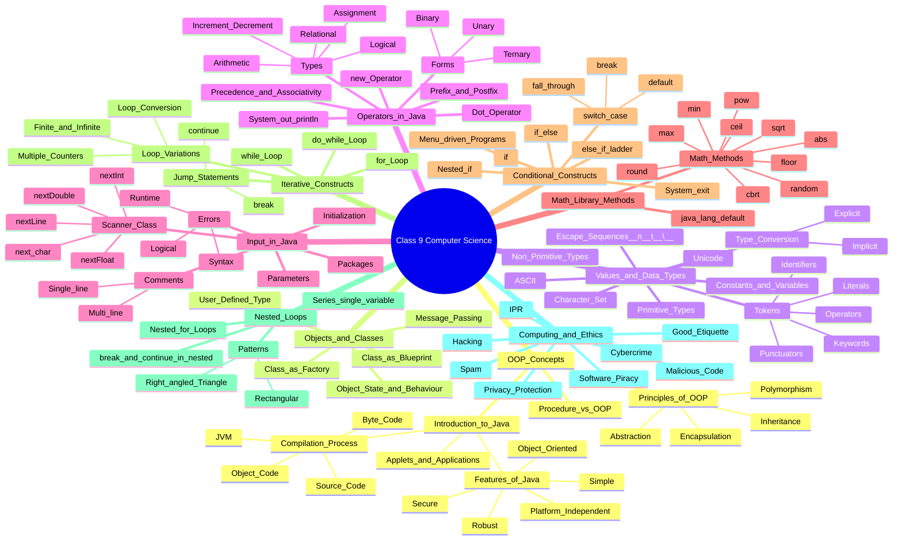

# Syllabus

```mermaid
mindmap
  root((Class 9 Computer Science))
    OOP_Concepts
      Principles_of_OOP
        Abstraction
        Encapsulation
        Inheritance
        Polymorphism
      Procedure_vs_OOP
      Introduction_to_Java
        Applets_and_Applications
        Compilation_Process
          Source_Code
          Byte_Code
          Object_Code
          JVM
        Features_of_Java
          Simple
          Robust
          Secure
          Platform_Independent
          Object_Oriented
    Objects_and_Classes
      Object_State_and_Behaviour
      Class_as_Blueprint
      Class_as_Factory
      User_Defined_Type
      Message_Passing
    Values_and_Data_Types
      Character_Set
      ASCII
      Unicode
      Escape_Sequences__n__t__\\__
      Tokens
        Keywords
        Identifiers
        Literals
        Punctuators
        Operators
      Constants_and_Variables
      Primitive_Types
      Non_Primitive_Types
      Type_Conversion
        Implicit
        Explicit
    Operators_in_Java
      Forms
        Unary
        Binary
        Ternary
      Types
        Arithmetic
        Relational
        Logical
        Assignment
        Increment_Decrement
      Precedence_and_Associativity
      Prefix_and_Postfix
      new_Operator
      Dot_Operator
      System_out_println
    Input_in_Java
      Initialization
      Parameters
      Packages
      Scanner_Class
        nextInt
        nextFloat
        nextDouble
        nextLine
        next_char
      Errors
        Syntax
        Runtime
        Logical
      Comments
        Single_line
        Multi_line
    Math_Library_Methods
      java_lang_default
      Math_Methods
        pow
        sqrt
        cbrt
        ceil
        floor
        round
        abs
        max
        min
        random
    Conditional_Constructs
      if
      if_else
      else_if_ladder
      Nested_if
      switch_case
        default
        break
        fall_through
      Menu_driven_Programs
      System_exit
    Iterative_Constructs
      for_Loop
      while_Loop
      do_while_Loop
      Loop_Variations
        Multiple_Counters
        Finite_and_Infinite
        Loop_Conversion
      Jump_Statements
        break
        continue
    Nested_Loops
      Nested_for_Loops
      Patterns
        Rectangular
        Right_angled_Triangle
      Series_single_variable
      break_and_continue_in_nested
    Computing_and_Ethics
      IPR
      Privacy_Protection
      Spam
      Software_Piracy
      Cybercrime
      Hacking
      Malicious_Code
      Good_Etiquette
```